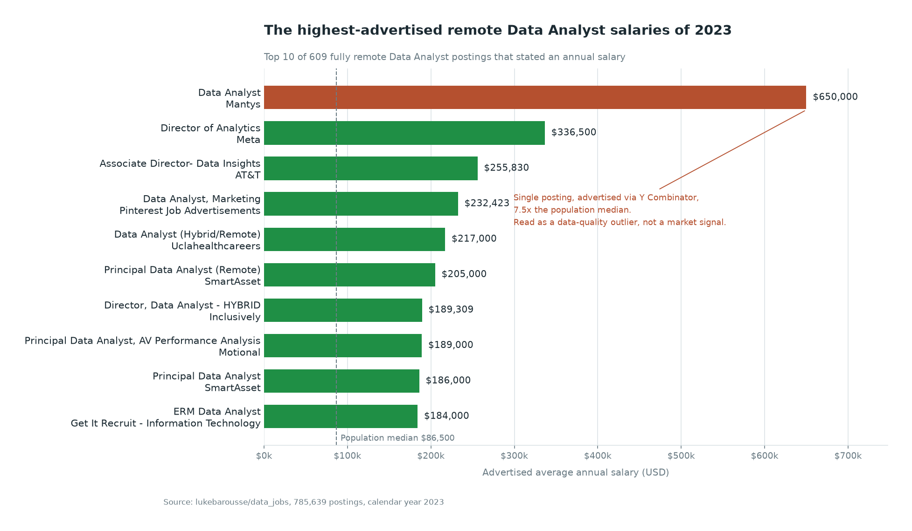
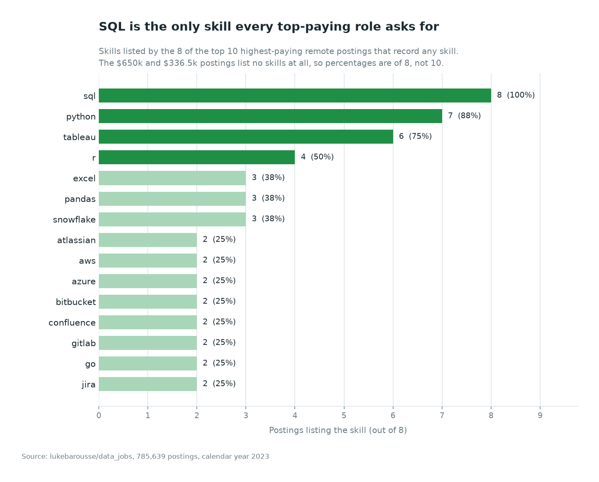
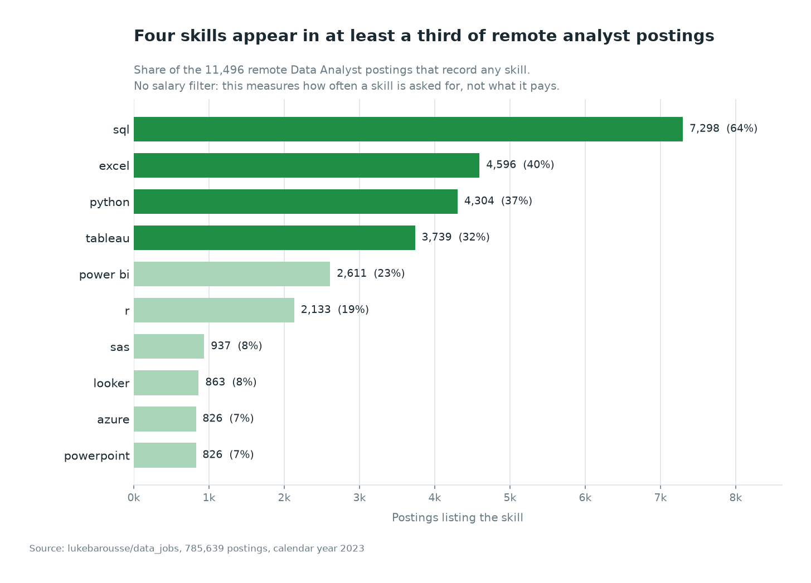
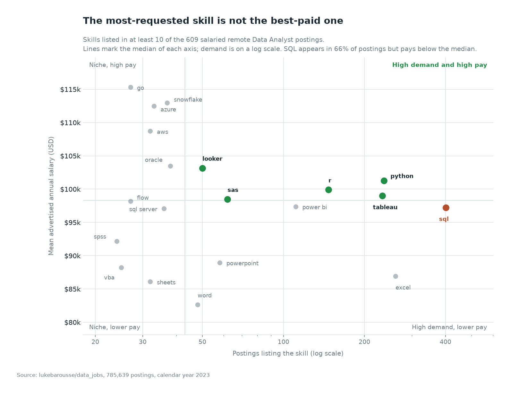
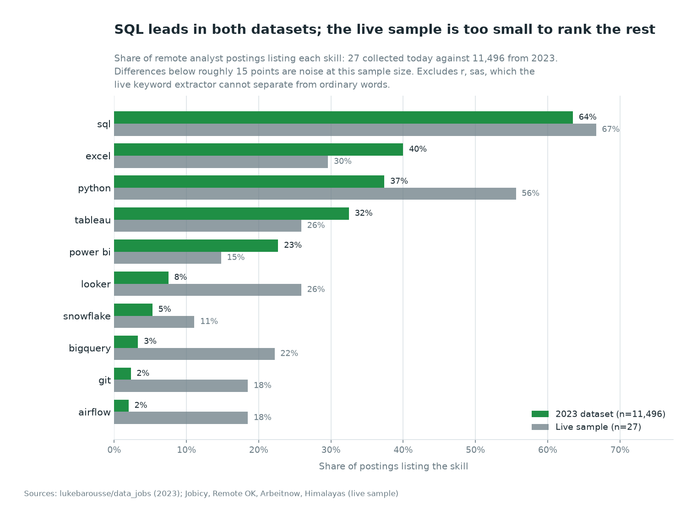

# Remote Data Analyst Job Market

Which skills are worth learning for a remote data analyst role, and what do they pay.

Built on 785,639 job postings from 2023, then re-run on live postings collected
today through the same schema and the same SQL.

**Revision 2** (2026-08-29). Revision 1 reported figures from a stale extract and
ranked skills on samples of one or two postings. See [Corrections](#corrections).

---

## Key findings

1. **SQL is the entry ticket, not the differentiator.** It appears in 66% of
   salaried remote analyst postings, more than twice any other skill, but pays
   $97,224 on average, below the $98,344 median of the skills analysed.
2. **Python, Tableau, R, SAS and Looker clear the median on both demand and pay.**
   These are the skills that are both asked for and rewarded.
3. **The best-paid skills are platform skills, and they are niche.** Snowflake,
   Azure, AWS and Go pay 12-19% above SQL but appear in 27-37 postings each,
   against SQL's 401.
4. **Four skills cover most of the market.** SQL, Excel, Python and Tableau each
   appear in at least a third of postings. After R the frequency falls off a cliff.
5. **Pay figures rest on 4.6% of postings.** Only 609 of 13,321 remote analyst
   postings state a salary. This is the single biggest limitation of the analysis.

Practical order: SQL and one BI tool to be considered, Python to compete, then a
cloud or warehouse skill to move up the pay distribution.

---

## Framework and tools

| | |
|---|---|
| Process framework | CRISP-DM |
| Analytical framework | Demand-versus-pay quadrant matrix, split at the median of each axis |
| Database | DuckDB (analysis queries are standard SQL and run unchanged on PostgreSQL) |
| Query layer | SQL - CTEs, window functions, aggregate filters, `PERCENTILE_CONT` |
| Pipeline and charts | Python 3.12, pandas, matplotlib |
| Live ingestion | Python `urllib`, four public REST APIs, no keys |
| Version control | Git |

### CRISP-DM stages

| Stage | What it covers | Where |
|---|---|---|
| Business understanding | Five questions on skill demand and pay for remote analyst roles | This README |
| Data understanding | Population funnel, duplicate detection, outlier and coverage checks | `sql/06_data_quality_checks.sql` |
| Data preparation | Denormalised CSV split into a star schema, deterministic keys, duplicates removed | `scripts/build_database.py`, `sql/00_schema.sql` |
| Analysis | Five analysis queries plus a supporting demand lookup | `sql/01`-`sql/05`, `sql/07` |
| Evaluation | Minimum-sample floors, medians alongside means, coverage stated per question | Below, and in each query header |
| Deployment | Live collector re-running the same SQL on current postings | `scripts/collect_live_postings.py` |

---

## Data

| | |
|---|---|
| Source | [`lukebarousse/data_jobs`](https://huggingface.co/datasets/lukebarousse/data_jobs) |
| Collection | Scraped from Google Jobs via SerpApi through 2023 |
| Snapshot | Revision `ed776e5a`, 2025-06-03, 231,152,089 bytes |
| Licence | Apache 2.0 |
| Loaded | 785,639 rows after removing 101 fully-identical duplicates |

The source is one denormalised CSV with no keys. `scripts/build_database.py` splits
it into a four-table star schema with deterministic surrogate keys.

### Population funnel

Every denominator in this analysis comes from this table.

| Step | Postings |
|---|---:|
| All postings | 785,639 |
| Data Analyst | 196,050 |
| Data Analyst, remote | 13,321 |
| ...listing at least one skill | 11,496 |
| ...stating an annual salary | 609 |

Scope: `job_title_short = 'Data Analyst'`, `job_work_from_home = TRUE` (verified
equivalent to `job_location = 'Anywhere'`), calendar year 2023, global with a
United States weighting. Adjacent titles and non-remote roles are out of scope.

---

## Analysis

### 1. Top-paying remote roles

Range $184,000 to $650,000, or $184,000 to $336,500 excluding the outlier below,
against a population median of $86,500. Six of the ten are Director, Associate
Director or Principal roles: seniority explains most of the top of the distribution.



| Percentile | Advertised salary |
|---|---:|
| Minimum | $25,000 |
| 25th | $75,000 |
| Median | $86,500 |
| 75th | $107,500 |
| Maximum | $650,000 |

[`sql/01_top_paying_remote_roles.sql`](sql/01_top_paying_remote_roles.sql)

### 2. Skills in those roles

Eight of the ten postings record any skill. The $650,000 and $336,500 postings list
none, so the denominator is eight.



SQL in all eight, Python in seven, Tableau in six. Below that, eight skills tie at
two postings, which is too thin to rank.

[`sql/02_skills_in_top_paying_roles.sql`](sql/02_skills_in_top_paying_roles.sql)

### 3. Most in-demand skills

All 11,496 remote analyst postings that record a skill. No salary filter.



| Skill | Postings | Share |
|---|---:|---:|
| sql | 7,298 | 64% |
| excel | 4,596 | 40% |
| python | 4,304 | 37% |
| tableau | 3,739 | 32% |
| power bi | 2,611 | 23% |
| r | 2,133 | 19% |

After R the next skill, SAS, appears in 8%.

[`sql/03_most_in_demand_skills.sql`](sql/03_most_in_demand_skills.sql)

### 4. Highest-paying skills

Skills in at least ten salaried postings. Medians shown alongside means because
these samples are small enough for one posting to move a mean.

| Skill | Postings | Mean | Median |
|---|---:|---:|---:|
| databricks | 10 | $141,907 | $127,500 |
| go | 27 | $115,320 | $104,300 |
| confluence | 11 | $114,210 | $101,500 |
| hadoop | 22 | $113,193 | $110,500 |
| snowflake | 37 | $112,948 | $106,479 |
| azure | 33 | $112,474 | $105,000 |
| bigquery | 12 | $111,292 | $121,000 |
| aws | 32 | $108,708 | $104,000 |
| jira | 20 | $104,918 | $94,500 |
| java | 16 | $104,526 | $94,750 |

Cloud platforms, warehouses and distributed processing dominate: a premium for
analysts who can work on the data platform, not only on top of it.

[`sql/04_highest_paying_skills.sql`](sql/04_highest_paying_skills.sql)

### 5. Demand against pay

The 20 skills clearing ten salaried postings, split at the median of each axis.



| Quadrant | Skills |
|---|---|
| High demand, high pay | python, tableau, r, sas, looker |
| High demand, lower pay | sql, excel, power bi, powerpoint, word |
| Niche, high pay | oracle, snowflake, azure, aws, go |
| Niche, lower pay | sql server, sheets, flow, vba, spss |

[`sql/05_optimal_skills.sql`](sql/05_optimal_skills.sql)

---

## Outliers and limitations

Stated up front because they change how the numbers should be read.

| Issue | Effect | Handling |
|---|---|---|
| **$650,000 Mantys posting** | 7.5x the median, single posting via Y Combinator | Kept, flagged on the chart. Removing inconvenient records is not defensible. Its effect on the mean is $94,539 to $93,626 |
| **Salary coverage 4.6%** | Employers who publish pay are not a random sample | Stated per question. Demand figures use all 11,496 skill-bearing postings and are unaffected |
| **Small per-skill samples** | Unfiltered, the pay ranking is led by PySpark (2 postings), then Couchbase and Watson at $160,515 each, which is one DIRECTV posting counted twice | Ten-posting floor on questions 4 and 5, sample sizes published, medians alongside means |
| **Missing skills in top roles** | The two highest-paid postings record no skills | Question 2 denominator is 8, not 10 |
| **Advertised, not earned pay** | `salary_year_avg` is a range midpoint, pre-negotiation | Stated |
| **Near-duplicate postings** | 1,285 postings in 613 groups share title, company, location, board and timestamp; 484 differ in extracted skills | 101 fully-identical rows dropped at load. The rest kept, since dropping them would discard skill data |
| **Aggregator reposting** | Staffing agencies repost heavily, over-weighting their postings | Documented, not corrected |

---

## Live pipeline

`scripts/collect_live_postings.py` pulls current postings from four keyless public
APIs, extracts skills against this project's own `skills_dim` vocabulary, and loads
them into **the same star schema**. The analysis is not reimplemented for live data,
the same SQL is re-pointed at it:

```bash
python scripts/collect_live_postings.py
python scripts/run_analysis.py --dataset live
```



SQL leads in both, at 67% live against 64% in 2023. BigQuery, Airflow, Git and
Looker are all markedly higher in the live sample, consistent with a tilt toward
data-platform tooling, but at 27 postings that is a signal to watch rather than a
finding.

**What the live pipeline cannot do.** No keyless public API publishes salary with
usable coverage for analyst roles: across 1,410 postings fetched, 109 analyst-type,
**zero** carried a salary. Questions 1, 2, 4 and 5 therefore return no rows against
the live dataset rather than a number built on nothing. Adding a free Adzuna or
USAJOBS API key would close this gap.

Skills are also keyword-matched from description text rather than curated, so terms
that are also ordinary words (`r`, `sas`, `go`) are excluded rather than reported
with false positives, and dropped from both sides of the comparison chart. The live
sources are remote-first and Europe-weighted, so the two populations differ.

---

## Reproduce

```bash
python -m venv .venv && source .venv/bin/activate
pip install -r requirements.txt

python scripts/build_database.py     # fetch ~231 MB, build the 2023 database
python scripts/run_analysis.py       # sql/ -> outputs/tables/
python scripts/build_charts.py       # outputs/tables/ -> outputs/charts/
```

For PostgreSQL instead of DuckDB, see [`sql/00_postgres_load.sql`](sql/00_postgres_load.sql).

---

## Corrections

Revision 1 errors that changed its conclusions.

| Issue | Revision 1 | Now |
|---|---|---|
| Top-paying skills | Ranked PySpark, Couchbase, Watson, DataRobot | One or two postings each. Ten-posting floor applied, sample sizes published |
| Stated conclusion | "Specialised skills like SVN and Solidity" | A different, non-remote population, one posting each. Removed |
| Question 2 | Percentages taken against 10 postings | Only 8 record a skill |
| Filters | `LIKE '%Data Analyst%'`, `LIKE '%Anywhere%'`, and comments describing populations the SQL did not query | One definition applied consistently |
| Charts | Misleading titles, an 11-way tie cut to an arbitrary 3 | Titles state population and denominator, ties shown in full |
| Reproducibility | Absolute paths to a non-existent directory, no source data | Every step runs from the repository |

---

## Structure

```
sql/
  00_schema.sql                  star schema, DuckDB and PostgreSQL
  00_postgres_load.sql           optional PostgreSQL load
  01-05                          the five analysis questions
  06_data_quality_checks.sql     evidence behind every caveat above
  07_skill_demand_all.sql        unranked demand lookup, used by the comparison chart
scripts/
  build_database.py              fetch, normalise, load
  run_analysis.py                --dataset 2023 | live
  build_charts.py                tables -> charts
  collect_live_postings.py       live APIs -> same schema
outputs/
  tables/  charts/               2023 results
  live/tables/                   live results, same queries
reference/sql_practice/          course exercises, not part of the analysis
data/                            not committed, rebuilt by script
```

Live postings: [Jobicy](https://jobicy.com), [Remote OK](https://remoteok.com),
[Arbeitnow](https://www.arbeitnow.com), [Himalayas](https://himalayas.app).
