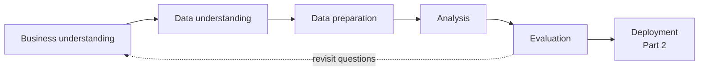
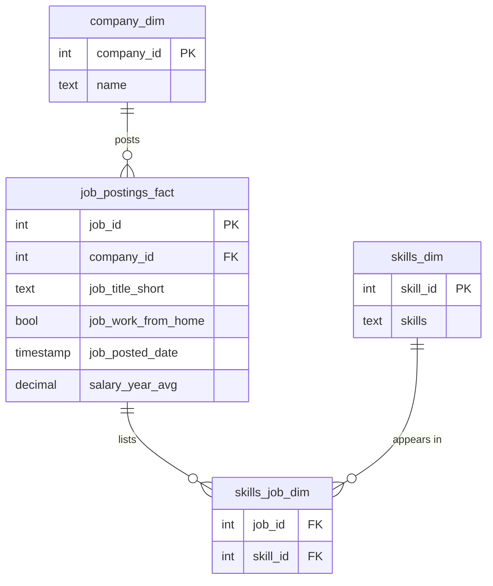

# Remote Data Analyst Job Market

Which skills are worth learning for a remote data analyst role, and what do they pay?

The project is in two parts:

| Part | Question | Data | Status |
| ---- | -------- | ---- | ------ |
| [1. The 2023 market](#part-1-the-2023-market) | What did remote data analyst roles ask for and pay in 2023? | 785,639 postings from a SQL course dataset | Complete |
| [2. The current market](#part-2-the-current-market) | Has that changed, and how do we keep measuring it? | Live postings from public job APIs, loaded into the same data model | Prototype, data model in progress |

Part 1 builds a star schema and a set of SQL queries on the 2023 data. Part 2 reuses both, so any finding from 2023 can be re-run on current postings without rewriting the analysis.

---

# Part 1: The 2023 market

## Where the data comes from

The dataset comes from Luke Barousse's SQL for data analytics course: 785,741 job postings scraped from Google Jobs through 2023 and published as [`lukebarousse/data_jobs`](https://huggingface.co/datasets/lukebarousse/data_jobs). The course exercises I worked through are kept in [`reference/sql_practice/`](reference/sql_practice/). The analysis in [`sql/`](sql/) goes further than the course project: it adds a documented population funnel, minimum sample sizes, medians next to means, and data-quality checks behind every caveat.

## Key findings

1. **SQL gets you considered, but it doesn't set you apart.** It appears in 66% of salaried remote analyst postings, about 1.5 times as often as Excel, the next most common skill. Its average pay, $97,224, is below the $98,344 median of the skills analysed.
2. **Python, Tableau, R, SAS and Looker are above the median on both demand and pay.** Employers ask for these skills and pay more for them.
3. **The best-paid skills are platform skills, and few postings ask for them.** Snowflake, Azure, AWS and Go pay 12-19% more than SQL, but each appears in only 27-37 salaried postings, against SQL's 401.
4. **Four skills cover most of the market.** SQL, Excel, Python and Tableau each appear in at least 30% of postings. After R, how often a skill appears drops sharply: SAS, the next one, is at 8%.
5. **Pay figures rest on 4.6% of postings.** Only 609 of 13,321 remote analyst postings state a salary. This is the biggest limitation of the analysis.

Suggested learning order: SQL and one BI tool to get considered, Python to compete, then a cloud or warehouse skill to reach the higher pay bands.

## Approach

The work follows CRISP-DM. Part 2 is this project's deployment stage: the same pipeline running against current data.



| Stage                  | What it covers                                                                    | Where                                            |
| ---------------------- | --------------------------------------------------------------------------------- | ------------------------------------------------ |
| Business understanding | Five questions on skill demand and pay for remote analyst roles                   | This README                                      |
| Data understanding     | Population funnel, duplicate detection, outlier and coverage checks               | `sql/06_data_quality_checks.sql`                 |
| Data preparation       | Denormalised CSV split into a star schema, deterministic keys, duplicates removed | `scripts/build_database.py`, `sql/00_schema.sql` |
| Analysis               | Five analysis queries plus a supporting demand lookup                             | `sql/01`-`sql/05`, `sql/07`                      |
| Evaluation             | Minimum-sample floors, medians alongside means, coverage stated per question      | Below, and in each query header                  |
| Deployment             | Same schema and queries re-run on current postings                                | [Part 2](#part-2-the-current-market)             |

| Tool                 | Used for                                                                   |
| -------------------- | -------------------------------------------------------------------------- |
| Analytical framework | Demand-versus-pay quadrant matrix, split at the median of each axis        |
| Database             | DuckDB (analysis queries are standard SQL and run unchanged on PostgreSQL) |
| Query layer          | SQL: CTEs, window functions, aggregate filters, `PERCENTILE_CONT`          |
| Pipeline and charts  | Python 3.13, pandas, matplotlib                                            |
| Live ingestion       | Python `urllib`, four public REST APIs, no keys                            |

## Data model

The source is one denormalised CSV with no keys. `scripts/build_database.py` splits it into a star schema with deterministic surrogate keys, so repeated builds produce identical ids. Part 2 loads into this same schema.



| Info       | Detail                                                                                     |
| ---------- | ------------------------------------------------------------------------------------------ |
| Source     | [`lukebarousse/data_jobs`](https://huggingface.co/datasets/lukebarousse/data_jobs)         |
| Collection | Scraped from Google Jobs via SerpApi through 2023                                          |
| Snapshot   | Revision `ed776e5a`, 2025-06-03, 231,152,089 bytes, 785,741 rows                           |
| Licence    | Apache 2.0                                                                                 |
| Loaded     | 785,639 rows: 101 fully-identical duplicates removed, and 1 empty row with no company name |

### Population funnel

Every denominator in this analysis comes from this table.

| Step                          | Postings |
| ----------------------------- | -------- |
| All postings                  | 785,639  |
| Data Analyst                  | 196,050  |
| Data Analyst, remote          | 13,321   |
| ...listing at least one skill | 11,496   |
| ...stating an annual salary   | 609      |

Scope: `job_title_short = 'Data Analyst'`, `job_work_from_home = TRUE` (verified equivalent to `job_location = 'Anywhere'`), calendar year 2023, global with a United States weighting. Adjacent titles and non-remote roles are out of scope.

## Analysis

### 1. Top-paying remote roles

Salaries range from $184,000 to $650,000, or $184,000 to $336,500 without the outlier below. The population median is $86,500. Six of the ten are Director, Associate Director or Principal roles, so seniority explains most of the top of the distribution.


| Percentile | Advertised salary |
| ---------- | ----------------- |
| Minimum    | $25,000           |
| 25th       | $75,000           |
| Median     | $86,500           |
| 75th       | $107,500          |
| Maximum    | $650,000          |

Query: [`sql/01_top_paying_remote_roles.sql`](sql/01_top_paying_remote_roles.sql)

### 2. Skills in those roles

Eight of the ten postings list at least one skill. The $650,000 and $336,500 postings list none, so the denominator is eight.


SQL is in all eight, Python in seven and Tableau in six. Below that, eight skills are tied at two postings each, which is too few to rank.

Query: [`sql/02_skills_in_top_paying_roles.sql`](sql/02_skills_in_top_paying_roles.sql)

### 3. Most in-demand skills

This covers all 11,496 remote analyst postings that record a skill, with no salary filter.


| Skill    | Postings | Share |
| -------- | -------- | ----- |
| sql      | 7,298    | 64%   |
| excel    | 4,596    | 40%   |
| python   | 4,304    | 37%   |
| tableau  | 3,739    | 32%   |
| power bi | 2,611    | 23%   |
| r        | 2,133    | 19%   |

After R, the next skill, SAS, appears in 8% of postings.

Query: [`sql/03_most_in_demand_skills.sql`](sql/03_most_in_demand_skills.sql)

### 4. Highest-paying skills

This ranks skills that appear in at least ten salaried postings. Medians are shown next to means because the samples are small enough for one posting to move a mean.

| Skill      | Postings | Mean     | Median   |
| ---------- | -------- | -------- | -------- |
| databricks | 10       | $141,907 | $127,500 |
| go         | 27       | $115,320 | $104,300 |
| confluence | 11       | $114,210 | $101,500 |
| hadoop     | 22       | $113,193 | $110,500 |
| snowflake  | 37       | $112,948 | $106,479 |
| azure      | 33       | $112,474 | $105,000 |
| bigquery   | 12       | $111,292 | $121,000 |
| aws        | 32       | $108,708 | $104,000 |
| jira       | 20       | $104,918 | $94,500  |
| java       | 16       | $104,526 | $94,750  |

Cloud platforms, data warehouses and distributed processing dominate the list. Analysts who can work on the data platform itself, not only on top of it, are paid more.

Query: [`sql/04_highest_paying_skills.sql`](sql/04_highest_paying_skills.sql)

### 5. Demand against pay

These are the 20 skills that appear in at least ten salaried postings, split at the median of each axis.


| Quadrant               | Skills                                 |
| ---------------------- | -------------------------------------- |
| High demand, high pay  | python, tableau, r, sas, looker        |
| High demand, lower pay | sql, excel, power bi, powerpoint, word |
| Niche, high pay        | oracle, snowflake, azure, aws, go      |
| Niche, lower pay       | sql server, sheets, flow, vba, spss    |

Query: [`sql/05_optimal_skills.sql`](sql/05_optimal_skills.sql)

## Outliers and limitations

These are stated up front because they change how the numbers should be read. Each is backed by a query in [`sql/06_data_quality_checks.sql`](sql/06_data_quality_checks.sql).

| Issue                           | Effect                                                                                                                                             | Handling                                                                                                                      |
| ------------------------------- | -------------------------------------------------------------------------------------------------------------------------------------------------- | ----------------------------------------------------------------------------------------------------------------------------- |
| **$650,000 Mantys posting**     | 7.5x the median; a single posting advertised through Y Combinator                                                                                  | Kept and flagged on the chart, because dropping inconvenient records is not defensible. It moves the mean from $93,626 to $94,539 |
| **Salary coverage 4.6%**        | Employers who publish pay are not a random sample                                                                                                  | Stated for each question. Demand figures use all 11,496 skill-bearing postings and are unaffected                             |
| **Small per-skill samples**     | Without a floor, the pay ranking is led by PySpark (2 postings), then Couchbase and Watson at $160,515 each, which is one DIRECTV posting counted twice | A ten-posting floor on questions 4 and 5, sample sizes published, and medians next to means                                  |
| **Missing skills in top roles** | The two highest-paid postings list no skills                                                                                                       | The question 2 denominator is 8, not 10                                                                                       |
| **"Remote" includes hybrid**    | Two of the top 10 "remote" postings have Hybrid in the title                                                                                       | Stated. The source's remote flag is used as published                                                                         |
| **Advertised, not earned pay**  | `salary_year_avg` is the midpoint of the advertised range, before negotiation                                                                      | Stated                                                                                                                        |
| **Near-duplicate postings**     | 1,285 postings in 613 groups share title, company, location, board and timestamp; in 586 of those groups the copies list different skills                            | 101 fully-identical rows dropped at load. The rest are kept, because dropping them would lose skill data                      |
| **Aggregator reposting**        | Staffing agencies repost heavily, so their postings are over-weighted                                                                              | Documented, not corrected                                                                                                     |

---

# Part 2: The current market

Part 1 describes 2023. Part 2 asks whether that picture still holds, and builds the data model needed to keep checking.

## What exists today: the live prototype

`scripts/collect_live_postings.py` pulls current postings from four public APIs that need no key (Arbeitnow, Jobicy, Remote OK, Himalayas). It extracts skills from each description using the `skills_dim` vocabulary from Part 1, and loads the postings into the same star schema. The Part 1 queries then run on the live data unchanged:

```bash
python scripts/collect_live_postings.py
python scripts/run_analysis.py --dataset live   # sql/ -> outputs/live/tables/
python scripts/build_charts.py                  # adds the comparison chart
```

The committed sample was collected on 29 August 2026: 55 postings, 31 classed as Data Analyst, 27 of them with at least one skill.


SQL leads in both samples: 67% of live postings against 64% in 2023. BigQuery, Airflow, Git and Looker appear much more often in the live sample. That fits a shift toward data-platform tooling, but 27 postings is too few to call it a finding, so treat it as something to watch.

## What the data model needs to fix

The prototype showed that the queries carry over. It also showed where live data breaks the 2023 assumptions. These gaps are the requirements for the Part 2 data model:

| Gap | What happens now | Why it matters |
| --- | ---------------- | -------------- |
| **Role classification is too broad** | `classify()` maps any title containing "analy" to Data Analyst. Only 6 of the 31 live "Data Analyst" postings have that title; the rest include Procurement Analyst, Quant Risk Analyst and Analytics Engineer | The live sample and the 2023 sample are not the same population, so the comparison chart overstates how comparable they are |
| **No salary** | Across 1,410 postings fetched, none of the 109 analyst-type postings had a salary | Questions 1, 2, 4 and 5 return no rows on live data. A free Adzuna or USAJOBS API key would fill this gap |
| **Posting date is the collection date** | `job_posted_date` is set to when the script ran | Trends over time cannot be measured until the real posting date is kept and collections are appended, not overwritten |
| **Each collection replaces the last** | The live database is rebuilt from scratch on every run | There is no history to compare against. Appending each run with a collection id would make this a time series |
| **Keyword skill extraction** | Skills are matched in free text, so names that are also ordinary words (`r`, `sas`, `go`) are excluded | These skills are dropped from both sides of the comparison chart, so R and SAS cannot be tracked |
| **Different source mix** | Live sources are remote-first job boards weighted toward Europe; 2023 came from Google Jobs, weighted toward the US | Differences between the two may come from the sources rather than from the market |

---

## Repository layout

| Path | Contents |
| ---- | -------- |
| `sql/00_*` | Schema, and an optional PostgreSQL loader |
| `sql/01`-`05` | The five analysis questions |
| `sql/06` | Data-quality checks behind every caveat above |
| `sql/07` | Full skill-demand table, used by the live comparison |
| `scripts/` | Build the database, run the queries, draw the charts, collect live postings |
| `outputs/tables/`, `outputs/live/tables/` | Query results as CSV, one file per query |
| `outputs/charts/` | Charts, drawn only from the CSVs so they cannot drift from the queries |
| `reference/sql_practice/` | SQL course exercises, not part of the analysis pipeline |
| `data/` | Source file and databases. Not committed; rebuilt by the scripts |

## Reproduce

Requires [uv](https://docs.astral.sh/uv/).

```bash
uv venv && source .venv/bin/activate
uv pip install -r requirements.txt

python scripts/build_database.py     # downloads ~231 MB, builds the 2023 database
python scripts/run_analysis.py       # sql/ -> outputs/tables/
python scripts/build_charts.py       # outputs/tables/ -> outputs/charts/
```

To use PostgreSQL instead of DuckDB, see the steps at the top of [`sql/00_postgres_load.sql`](sql/00_postgres_load.sql).

## Credits

- 2023 data: [`lukebarousse/data_jobs`](https://huggingface.co/datasets/lukebarousse/data_jobs), Apache 2.0, from Luke Barousse's SQL course.
- Live postings: Arbeitnow, Jobicy, Remote OK and Himalayas public APIs.
